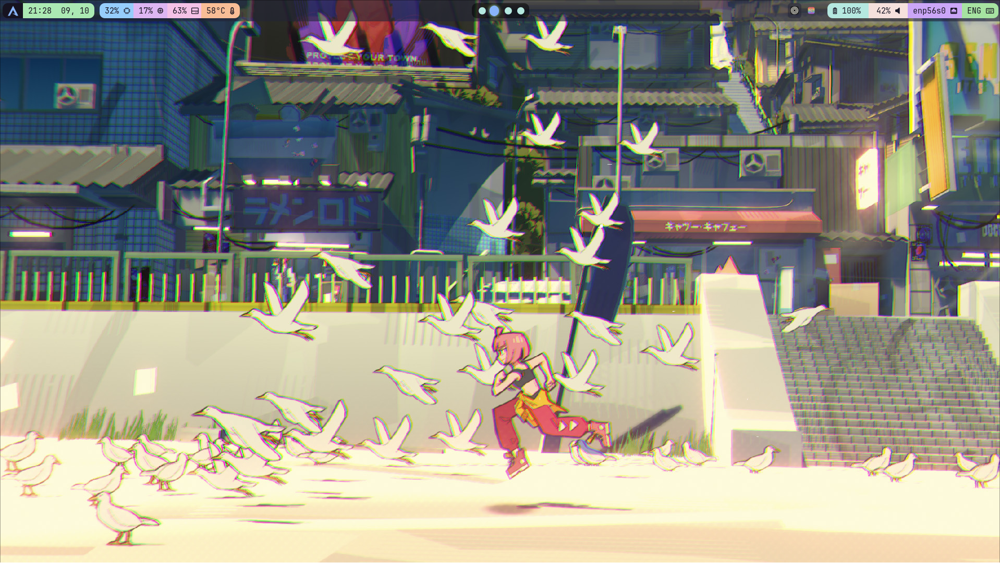
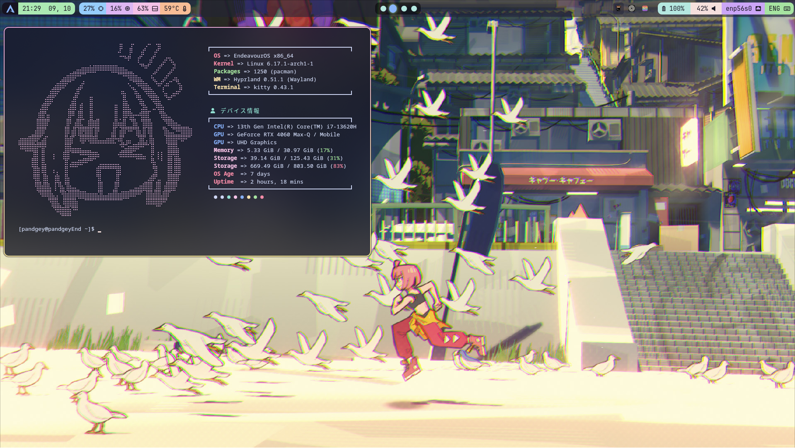

# dots

Pandgey's Hyprland config

- OS: endeavourOS
- DE: hyprland
- Bar: waybar
- Terminal: kitty
- App launcher: rofi
- Shell: zsh
- Fetch: fastfetch
- Visualizer: cava
- Text Editor: neovim
- File manager: nemo

# Showcase





# Installation

Assuming you are using Arch-based OS and (probably) using yay as AUR
1. Install dependencies
```bash
yay -S hyprland hyprpaper waybar xdg-desktop-portal-hyprland pavucontrol ttf-fira-sans ttf-font-awesome ttf-jetbrains-mono-nerd kitty cava fastfetch rofi nemo grim slurp
```
2. Clone new configuration
```bash
cd Downloads/
git clone https://github.com/pandgey/pandgeyDots.git
```
3. Copy all the stuff that you need

Awesome! You now have your very WM (or mine at least :D )!

# Grub

I use this [grub](https://github.com/jacksaur/Gorgeous-GRUB?tab=readme-ov-file). It has lots of stuff, design and options there. Pick one that suits you! Everyone say "Thank you, Jacksaur!". Currently, Im using the lobotomy corporation theme :D idk i like the color
